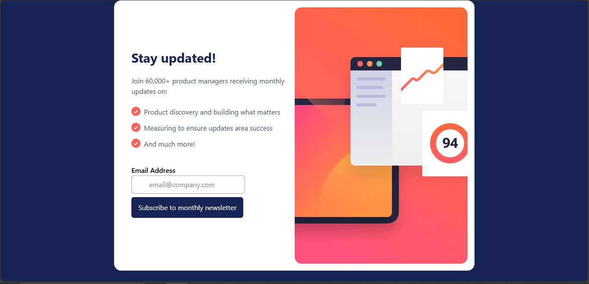

# Frontend Mentor - Newsletter sign-up form with success message solution

This is a solution to the [Newsletter sign-up form with success message challenge on Frontend Mentor](https://www.frontendmentor.io/challenges/newsletter-signup-form-with-success-message-3FC1AZbNrv). Frontend Mentor challenges help you improve your coding skills by building realistic projects. 

## Table of contents

- [Overview](#overview)
  - [The challenge](#the-challenge)
  - [Screenshot](#screenshot)
  - [Links](#links)
- [My process](#my-process)
  - [Built with](#built-with)
  - [What I learned](#what-i-learned)
  - [Useful resources](#useful-resources)
- [Author](#author)

## Overview

### The challenge

Users should be able to:

- Add their email and submit the form
- See a success message with their email after successfully submitting the form
- See form validation messages if:
  - The field is left empty
  - The email address is not formatted correctly
- View the optimal layout for the interface depending on their device's screen size
- See hover and focus states for all interactive elements on the page

### Screenshot



### Links

- Solution URL: [https://github.com/Creative-tobi/newsletter](https://github.com/Creative-tobi/newsletter)
- Live Site URL: [https://newsletter-six-gamma.vercel.app/](https://newsletter-six-gamma.vercel.app/)

## My process

### Built with

- Semantic HTML5 markup
- CSS custom properties
- Flexbox
- Mobile-first workflow
- Vanilla JavaScript

### What I learned

This project was a fantastic exercise in applying my foundational skills in HTML, CSS, and vanilla JavaScript. My key learnings focused on handling user input and manipulating the DOM.

1. Form Validation with a Conditional Statement
I learned how to validate the form submission using a simple conditional statement. I checked if the email input field was empty and also if it contained both an `@` symbol and a `.` to ensure it resembled a valid email address.

```js
// This code is an example of the conditional logic I used
const input = document.getElementById('input');
const errorState = document.getElementById('errorState');


//validating the input field
function subscribe(){
  if((input.value).includes("@") && (input.value).includes(".")){
    input.style.borderColor = "green"; 
    window.location.href = "alert.html"
  } else{
    errorState.innerHTML = "Invalid email address";
    errorState.style.color = "red";
    input.style.borderColor = "red"; 
    console.log("invalid mail");
    
  }
}

btn.addEventListener("click", subscribe)


Useful resources

- [Tailwind CDN](https://www.example.com) - This helped me for XYZ reason. I really liked this pattern and will use it going forward.

Author

- Website - [Creative-tobi](https://newsletter-six-gamma.vercel.app/)
- Frontend Mentor - [@Creative-tobi](https://www.frontendmentor.io/profile/Creative-tobi)
- Twitter - [@aish15294](https://x.com/aish15294)

